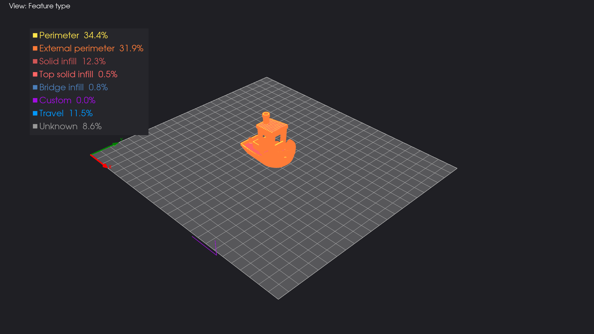

# gcode-viewer

3D G-code toolpath viewer with interactive GUI and CLI PNG export. Supports `.gcode` and `.bgcode` files via [gcode-lib](https://github.com/rlewis/gcode-lib).



## Features

- Interactive 3D visualization with layer-by-layer slider
- 6 color modes: feature type, height, speed, fan speed, temperature, volumetric flow
- Static PNG export for batch/CI workflows
- 4 camera presets (isometric, top, front, side) + custom azimuth/elevation
- PrusaSlicer TYPE comment parsing for feature-type coloring
- Auto-detected bed dimensions with grid overlay

## Installation

Requires Python >= 3.10 and [uv](https://docs.astral.sh/uv/).

```bash
uv sync
```

> **Note:** [gcode-lib](https://github.com/rlewis/gcode-lib) >= 1.1.0 is required. Install it editable if developing locally:
> ```bash
> uv pip install -e /path/to/gcode-lib
> ```

## Usage

### Interactive GUI

```bash
gcode-viewer model.gcode
```

**Keyboard shortcuts:**

| Key | Action |
|-----|--------|
| `1` | Isometric camera |
| `2` | Top-down camera |
| `3` | Front camera |
| `4` | Side camera |
| `T` | Toggle travel moves |
| `V` | Cycle color mode |
| `S` | Save screenshot |

### CLI Export

```bash
# Basic export
gcode-viewer model.gcode --export output.png

# Custom options
gcode-viewer model.gcode -e output.png \
  --camera front \
  --layer 50 \
  --resolution 2560x1440 \
  --color-mode height \
  --show-travel \
  --no-bed

# Custom camera angle
gcode-viewer model.gcode -e output.png \
  --camera-azimuth 45 --camera-elevation 30
```

### CLI Options

| Option | Default | Description |
|--------|---------|-------------|
| `--export`, `-e` | — | Export PNG and exit |
| `--camera`, `-c` | `isometric` | Camera preset: `isometric`, `top`, `front`, `side` |
| `--camera-azimuth` | — | Custom azimuth (degrees) |
| `--camera-elevation` | — | Custom elevation (degrees) |
| `--layer`, `-l` | all | Maximum layer to display |
| `--resolution`, `-r` | `1920x1080` | Export resolution (WxH) |
| `--show-travel` | off | Show travel moves |
| `--no-bed` | off | Hide print bed |
| `--color-mode` | `feature` | `feature`, `height`, `speed`, `fan`, `temperature`, `flow` |

## Architecture

```
G-code file
    |
    v
extractor.py  -- gcode-lib parsing --> ToolpathData (layers of Segments)
    |
    v
renderer.py   -- PyVista scene     --> per-layer actors (visibility toggle)
    |
    v
gui.py / cli.py                    --> interactive viewer or PNG export
```

**Key design:** one PyVista actor per layer enables fast layer slider updates via visibility toggling — no geometry rebuild needed. Color mode changes recolor cell data in-place.

## Testing

```bash
# Unit tests (fast, ~2s)
uv run pytest -m "not integration"

# With coverage
uv run pytest -m "not integration" --cov=gcode_viewer --cov-report=term-missing

# Integration tests (requires benchy gcode file, ~12min)
uv run pytest -m integration

# Full suite
uv run pytest --cov=gcode_viewer
```

## Project Structure

```
src/gcode_viewer/
  __init__.py       # version
  __main__.py       # python -m entry point
  types.py          # ExtrusionType, ColorMode, Segment, LayerData, ToolpathData
  extractor.py      # G-code parsing via gcode-lib
  colors.py         # color palettes, gradients, legend labels
  camera.py         # camera preset calculations
  bed.py            # bed plane, grid, border geometry
  renderer.py       # PyVista scene assembly & recoloring
  gui.py            # interactive viewer (PyVista + Qt)
  cli.py            # argparse + export entry point
tests/
  conftest.py       # shared fixtures
  test_*.py         # unit & integration tests
```

## Dependencies

- [gcode-lib](https://github.com/rlewis/gcode-lib) — G-code parsing, arc linearization, volume detection
- [PyVista](https://pyvista.org/) — 3D mesh visualization and off-screen rendering
- [NumPy](https://numpy.org/) — array operations
- [PyQt6](https://www.riverbankcomputing.com/software/pyqt/) — GUI framework
